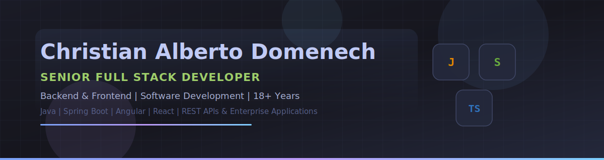
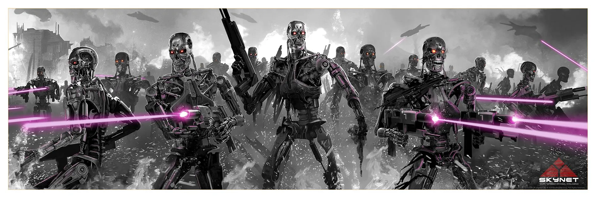

<!-- 🎨 BANNER SVG · TOKYO NIGHT -->

  

<!-- ⌨️ TYPING ANIMATION · líneas cortas + width amplio = sin recorte -->
<!-- Generador: https://readme-typing-svg.demolab.com/demo/ -->

  

  

# 👋 Hi, I'm Christian Alberto Domenech

**Senior Full Stack Developer · Backend & Frontend · Software Engineer**

  
  
  

---

## 👨‍💻 About Me

Senior Full Stack Developer with **18+ years** building enterprise software for **banking, telecom, e-commerce and digital platforms**. I focus on **backend development**, **frontend applications**, **REST APIs** and **clean, maintainable code**.

---

## 🛠 Tech Stack

  

  
  
  
  
  
  
  
  

---

## 📊 GitHub Analytics

  

  

  

---

## 📌 Featured Technologies

<table cellspacing="8" cellpadding="12">
<tr>
<td width="50%" valign="top" bgcolor="#1a1b26">

<h3 align="center">☕ Backend Engineering</h3>

  
  
Microservices, REST APIs, business logic, persistence and async processing with message queues. Scalable backend services built on Java/Spring and Node.js.

  

    
    
    
    
    
    
    
  

</td>
<td width="50%" valign="top" bgcolor="#1a1b26">

<h3 align="center">🎨 Frontend Development</h3>

  
  
Modern SPAs and enterprise web apps with Angular and React. Component architecture, TypeScript and performance-focused frontends.

  

    
    
    
    
    
    
  

</td>
</tr>
<tr>
<td width="50%" valign="top" bgcolor="#1a1b26">

<h3 align="center">☁️ Cloud & DevOps</h3>

  
  
Cloud-native deployment on AWS and Vercel, containers, orchestration, IaC, CI/CD pipelines and observability.

  

    
    
    
    
    
    
    
  

</td>
<td width="50%" valign="top" bgcolor="#1a1b26">

<h3 align="center">🗄 Databases & Caching</h3>

  
  
Relational and NoSQL data layers with PostgreSQL, Oracle, MySQL and SQL Server. MongoDB persistence and Redis caching for high-performance reads.

  

    
    
    
    
    
    
  

</td>
</tr>
<tr>
<td width="50%" valign="top" bgcolor="#1a1b26">

<h3 align="center">🛡 Security</h3>

  
  
Secure enterprise APIs with JWT and OAuth2 authentication, authorization with Spring Security, identity management with Keycloak and OWASP-aligned application design.

  

    
    
    
    
    
  

</td>
<td width="50%" valign="top" bgcolor="#1a1b26">

<h3 align="center">🔗 Web3 & Blockchain</h3>

  
  
Smart contracts with Solidity, WalletConnect integrations, secure libraries with OpenZeppelin and Ethereum dApp backends.

  

    
    
    
    
    
  

</td>
</tr>
</table>

---

## 💼 Career Timeline

  
  

    
    
    
    
    
    
  

| Period | Role | Focus |
|:------:|:-----|:------|
| **2007 – 2012** | Software Developer → Backend Developer | Java, enterprise apps, banking systems |
| **2012 – 2016** | Java Backend Developer | REST APIs, Spring, Oracle/PostgreSQL |
| **2016 – 2020** | Full Stack Developer | Backend + frontend, Angular, microservices |
| **2020 – 2024** | Senior Full Stack Developer | Java, Spring Boot, React, Node.js, MongoDB |
| **2024 – Now** | Senior Full Stack Developer | Enterprise software, APIs, AI-assisted development |

---

## 🌱 Currently Learning

  

| Period | Role | Focus |
|:------:|:-----|:------|
| **Now** | Advanced AI Engineering | AI-assisted development, intelligent software integration |
| **Now** | Multi-Agent Systems | Autonomous agents, orchestration & agent workflows |
| **Now** | LLM Applications | Production-ready apps powered by large language models |
| **Now** | Cloud Architecture | Scalable, resilient application design in the cloud |
| **Now** | Security Engineering | Secure APIs, authentication, OWASP best practices |
| **Now** | Distributed Systems | Microservices, high availability & system reliability |

---

## 💡 Random Dev Quote

  

---

## 📫 Contact

I'm open to collaborating on **full stack development**, **backend APIs**, **frontend applications** and **enterprise software** projects.

  

### *Building clean, scalable and maintainable software.*

