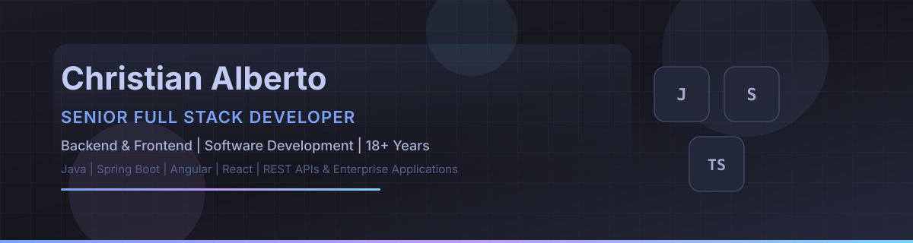
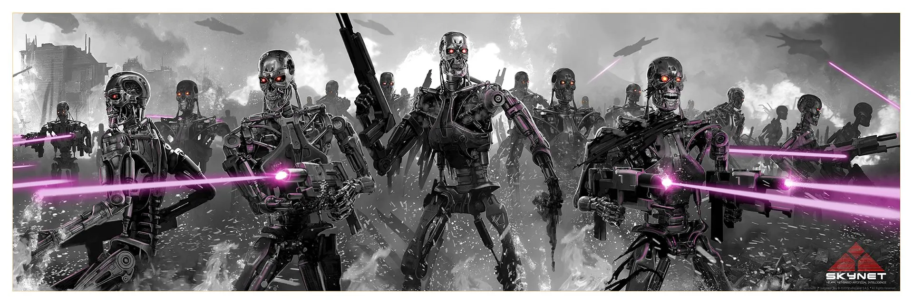

<!-- 🎨 BANNER SVG · TOKYO NIGHT -->

  

<!-- ⌨️ TYPING ANIMATION · líneas cortas + width amplio = sin recorte -->
<!-- Generador: https://readme-typing-svg.demolab.com/demo/ -->

 

 

  
  &nbsp;
  

---

##  About Me

Hi, I'm Christian Alberto, Senior Full Stack Developer with **18+ years** building enterprise software for **banking, telecom, e-commerce and digital platforms**. I focus on **backend development**, **frontend applications**, **REST APIs** and **clean, maintainable code**.

 

---

##  Core Competencies

<table>
<tbody>
<tr>
<th>Languages</th>
<td>
  
  
  
</td>
</tr>
<tr>
<th>Backend</th>
<td>
  
  
  
</td>
</tr>
<tr>
<th>Frontend</th>
<td>
  
  
  
</td>
</tr>
<tr>
<th>Databases</th>
<td>
  
  
  
  
</td>
</tr>
<tr>
<th>Cloud & DevOps</th>
<td>
  
  
  
</td>
</tr>
<tr>
<th>Security</th>
<td>
  
  
  
</td>
</tr>
<tr>
<th>Testing</th>
<td>
  
  
  
</td>
</tr>
<tr>
<th>Web3</th>
<td>
  
  
  
</td>
</tr>
</tbody>
</table>

 

---

 

Made with https://github-profiles-insights.vercel.app/

---

<strong>View full statistics</strong>

 

  

  

---

##  What I Do

| Area | Focus |
|:-----|:------|
| ** Backend Engineering** | Microservices, REST APIs, business logic, persistence and async processing with message queues. Scalable backend services built on Java/Spring and Node.js. |
| ** Frontend Development** | Modern web applications — SPAs, SSR and hybrid apps — with Angular, React and Next.js. Component architecture, TypeScript and performance-focused UIs. |
| ** Cloud & DevOps** | Cloud-native deployment, containers, orchestration, IaC, CI/CD pipelines and observability. |
| ** Databases & Caching** | Relational and NoSQL data layers, migrations and high-performance reads with caching. |
| ** Security** | Secure enterprise APIs: authentication, authorization, identity management and OWASP-aligned design. |
| ** Web3 & Blockchain** | Smart contracts, wallet integrations and secure dApp backends. |
| ** Testing & Quality** | Unit, integration and E2E testing; API validation and code quality gates. |

 

---

##  AI · Currently Learning

  

| Period | Role | Focus |
|:------:|:-----|:------|
| **Basics** | AI Fundamentals | Prompt engineering, LLM basics & AI-assisted coding |
| **Intermediate** | LLM & RAG | Embeddings, retrieval-augmented generation & AI APIs |
| **Advanced** | Multi-Agent Systems | Autonomous agents, orchestration & production AI workflows |

 

---

##  Contact

I'm open to collaborating on **full stack development**, **backend APIs**, **frontend applications** and **enterprise software** projects.

<table align="center" border="0" cellpadding="8" cellspacing="0">
  <tr>
  <td align="center" style="border: none; padding: 8px;">
      
    </td>
    <td align="center" style="border: none; padding: 8px;">
      
    </td>
    <td align="center" style="border: none; padding: 8px;">
      
    </td>
  </tr>
</table>

 

### *Building clean, scalable and maintainable software.*

